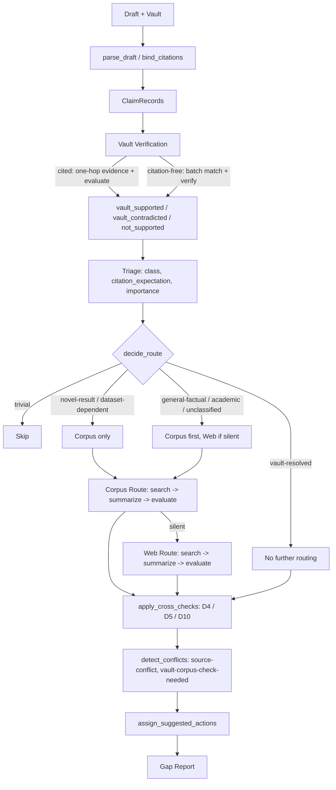
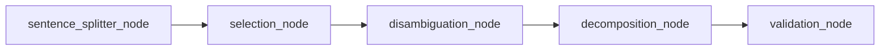

# ClaimeAI — Fact-Checking Agent

A fork of [BharathxD/ClaimeAI](https://github.com/BharathxD/ClaimeAI), an automated fact-checking system built on LangGraph that extracts factual claims from text (Claimify methodology) and verifies each one against evidence. This fork strips the original to the agent backend only (no web frontend, no Chrome extension) and rebuilds verification as a **three-tier evidence cascade** — Obsidian vault, corpus (RAG backend), and web search — with triage-gated routing, importance-anchored cross-checks, and automatic conflict detection between sources. It also adds PDF ingestion, OpenRouter support, and a Claude Code `/claimify` skill for CLI-driven fact-checking.

See [INSTALLATION.md](./INSTALLATION.md) for setup and [CLAUDE.md](./CLAUDE.md) for full developer/architecture context.

## Architecture Overview

The upstream project verified every claim against web search alone. This fork routes each claim through the cheapest evidence source that can resolve it before falling back to more expensive ones:

1. **Vault** — claims are checked against an Obsidian research vault (cited claims via one-hop link traversal, citation-free claims via batch matching).
2. **Corpus** — claims unresolved by the vault are checked against a document-RAG backend (`api.ragtogo.com`), scoped to cited source documents when available.
3. **Web** — claims still unresolved (or explicitly web-verifiable, e.g. novel/dataset-dependent claims) fall through to web search.

A triage pass classifies every claim first so trivial claims are skipped and claim type determines which tiers are eligible. Importance-gated cross-checks then re-verify high-stakes verdicts against a second source, and conflicts between sources are flagged rather than silently overwritten.


```mermaid
graph TD
    A[Draft + Vault] --> B[parse_draft / bind_citations]
    B --> C[ClaimRecords]
    C --> D[Vault Verification]
    D -->|cited: one-hop evidence + evaluate| E[vault_supported / vault_contradicted / not_supported]
    D -->|citation-free: batch match + verify| E
    E --> F[Triage: class, citation_expectation, importance]
    F --> G{decide_route}
    G -->|vault-resolved| H[No further routing]
    G -->|trivial| I[Skip]
    G -->|novel-result / dataset-dependent| J[Corpus only]
    G -->|general-factual / academic / unclassified| K[Corpus first, Web if silent]
    J --> L[Corpus Route: search -> summarize -> evaluate]
    K --> L
    L -->|silent| M[Web Route: search -> summarize -> evaluate]
    L --> N[apply_cross_checks: D4 / D5 / D10]
    M --> N
    H --> N
    N --> O[detect_conflicts: source-conflict, vault-corpus-check-needed]
    O --> P[assign_suggested_actions]
    P --> Q[Gap Report]
```

### Extraction (Claimify)


```mermaid
graph LR
    A[sentence_splitter_node] --> B[selection_node]
    B --> C[disambiguation_node]
    C --> D[decomposition_node]
    D --> E[validation_node]
```

Sentence splitting, selection and disambiguation use majority-vote LLM completions (2-of-3); decomposition extracts atomic claims; validation ensures they are well-formed.

## Key Features

- **Claimify extraction** — 5-stage pipeline (split → select → disambiguate → decompose → validate) with voting-based quality gates on selection and disambiguation.
- **Vault verification** — cited claims resolved via one-hop evidence gathering (`ingest/alignment.py`); citation-free claims resolved via mid-tier batch matching with high-tier adversarial re-verification (`ingest/vault_match.py`), including a full-vault fallback pass.
- **Corpus verification** — retrieval against a document-RAG backend, citation-scoped when the claim cites a known source document (`ingest/corpus_route.py`, `ingest/corpus_client.py`).
- **Web verification** — Exa/Tavily search with evidence summarization (mid tier) before high-tier evaluation, up to 5 search iterations per claim.
- **Triage-gated routing** — a single mid-tier batch call classifies every claim's type, citation expectation, and importance; routing policy decides vault/corpus/web eligibility per claim (`ingest/triage.py`, `ingest/routing.py`).
- **Cross-checks (D4/D5/D10)** — importance-gated re-verification: D4 scoped corpus attribution check on vault-resolved cited claims, D5 web confirmation on single-tier refutations, D10 web confirmation on high-importance supported claims.
- **Conflict detection** — source-conflict (shared-lineage vs. web disagreement) and vault-corpus-check-needed flags surfaced in the gap report rather than silently resolved.
- **4-verdict evaluators** — web: Supported / Refuted / Insufficient / Conflicting; corpus: corpus_supported / corpus_contradicted / corpus_insufficient / no_corpus_hits.
- **Configurable importance threshold** — cross-check gating threshold set in `config.toml`, independent of provider/model configuration.

## Quick Start

### Install

```bash
poetry install
```

Copy `.env.example` to `.env` and fill in required keys (see [Configuration](#configuration)).

### Light run (web-only verification, no vault required)

Start the LangGraph dev server:

```bash
poetry run dev
# equivalent to: langgraph dev --no-browser --allow-blocking
```

Or run directly against a PDF, markdown, or text file:

```bash
python scripts/run_from_pdf.py <path>
```

### Heavy run (vault + corpus + web cascade)

Requires an Obsidian vault and, for corpus scoping, a `RAG_API_KEY`:

```bash
python scripts/run_heavy.py <draft.md> --vault <vault_path> --corpus-ids <id1,id2>
```

This runs the full pipeline: parse draft → extract claims → bind citations → vault verification → triage → routing/cascade → cross-checks → gap report.

## Configuration

- **`config.toml`** — non-sensitive pipeline config: LLM provider and per-tier model registry (`low`/`mid`/`high`), search provider (default Exa), reasoning effort, corpus API settings, importance threshold. Env vars override `config.toml` values.
- **`.env`** — secrets only:

```
OPENAI_API_KEY=sk-proj-...
EXA_API_KEY=...
REDIS_URI=redis://localhost:6379
```

Optional: `TAVILY_API_KEY`, `LANGSMITH_API_KEY`, `OPENROUTER_API_KEY` (required when `llm_provider=openrouter`), `RAG_API_KEY` (required for corpus route).

## Testing

523 tests across unit, integration, and live-spot-check tiers.

```bash
poetry run pytest
```

Live spot-checks against a real vault are available via `scripts/spot_check_vault.py` and are excluded from the default suite.

## Module Structure

```
.
├── claim_extractor/   # Stage 1 — extract claims from text (Claimify method)
├── claim_verifier/    # Stage 2 — verify claims via web search + evidence summarization
├── fact_checker/      # Stage 3 — orchestrator, dispatches parallel verification
├── ingest/            # Stage 0 — PDF/text ingestion, vault + corpus verification, routing, gap reports
├── utils/             # Shared utilities (LLM, Redis, settings, claim record contract)
├── security/          # API key auth for LangGraph
└── scripts/           # CLI dev tools and runners
```

Each `claim_extractor`/`claim_verifier`/`fact_checker` module follows the same internal layout: `agent.py` (LangGraph workflow), `config/`, `llm/`, `nodes/`, `schemas.py`. All modules use LangGraph's `StateGraph` with async nodes and the `Send` mechanism for parallel dispatch.

## Further Reading

- [INSTALLATION.md](./INSTALLATION.md) — full setup instructions
- [CLAUDE.md](./CLAUDE.md) — developer context: directory layout, key files, full pipeline detail, conventions
- [docs/playbook/](./docs/playbook/) — design rationale (claim record taxonomy, model tier selection)
